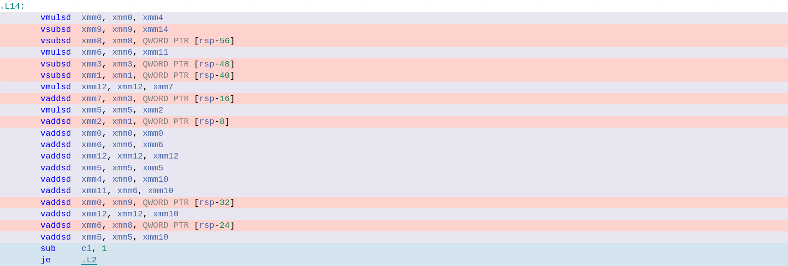
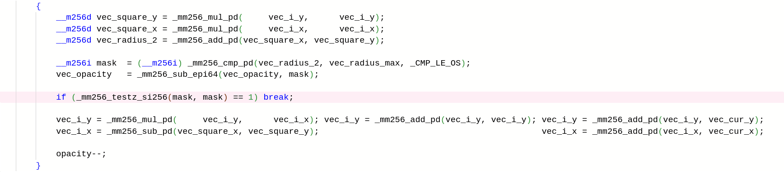
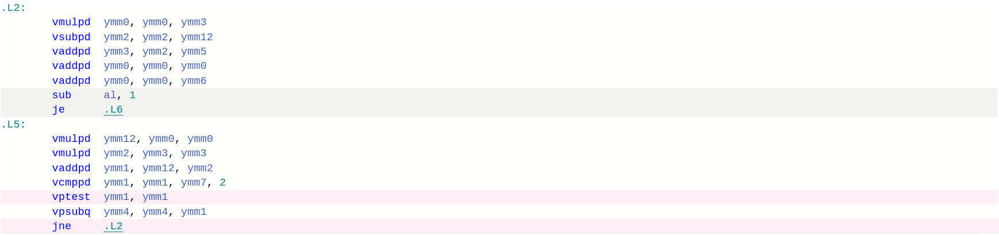
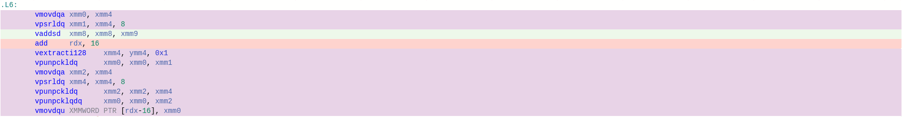
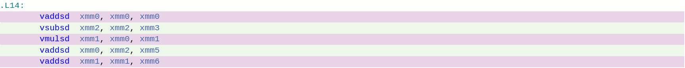

# Mandelbrot set

## Введение

Множество Мандельброта - множество точек плоскости, для задания которого каждой точке `A` с координатами `(x,y)` соответствует последовательность:

$$(x_0, y_0) = (x, y)               $$
$$ x_i = x_{i-1}^2 - y_{i-1}^2 + x_0$$
$$ y_i = 2x_{i-1} y_{i-1} + y_0     $$

Если последовательность ограничена, точка принадлежит множеству, иначе - нет.

Примерно так выглядит множество Мандельброта:


## Реализация

Для визуализации множества можно определить цвет пикселя, как функцию от `k`, где $|\vec{r}(x_k, y_k)| > R$, а $\forall i < k: |\vec{r}(x_i, y_i)|\leq R, (R - const)$.

Узким местом в программе является цикл, вычисляющий элементы последовательности выше, для нахождения `k`, по которому пересчитывается цвет пикселя. Реализовать вычисления можно разными способами:

* ### Попиксельная обработка
  * В теле цикла пересчета элементов последовательности обрабатывается один пиксель.
* ### Развертка цикла
  * Независимая обработка нескольких пикселей в теле цикла пересчета элементов последовательности. Попытка достичь аппаратного ускорения, засчет параллельного вычисления.
* ### SIMD инструкции
  * Использование **машиннозависимых** векторных инструкций процессора.

## Измерение

Цель задачи - измерение и анализ производительности каждой реализации. Отдельная программа запускала узкое место `100` раз  при размере окна `800*800` и находила среднее время выполнения.

Как запустить тестирование:

OS Linux:
```
cd src
make time
./time          // run all versions
./time --help   // show manual
```
Настройки (кол-во тестов для усреднения, размеры окна и т.д.) в src/maldenbrot_settings.h

Среда тестирования:

| CPU                   | Compiler   | OS                     |
|-----------------------|------------|------------------------|
| AMD Ryzen 7 PRO 5850U | GCC 11.3.0 | Linux Mint 21 Cinnamon |

Флаги сборки:
```
-O3 -mavx2
```

Результаты тестирования:

| Версия    | Время, мс | Коэффициент ускорения относительно начальной версии |
|-----------|-----------|-----------------------------------------------------|
| simple    |  68.16    | 1.00 (начальная версия)                             |
| all in    | 106.84    | 0.64                                                |
| separated |  94.80    | 0.72                                                |
| intrin    |  19.98    | 3.41                                                |

Описание версий (исходный код версий в src/maldenbrot_frame.cpp):

`simple` - попиксельная обработка

`all in` - развертка цикла, циклы векторизации в функции с узким местом

`separated` - развертка цикла, циклы векторизации в отдельных inline функциях

`intrin` - векторизация с использованием `AVX, AVX2` инструкций

## Анализ

Исходя из ассемблерного кода, сгенерированного компилятором, можно сделать следующие наблюдения:

### [***all in***](https://godbolt.org/z/ohnY9GE1j) & [***separated***](https://godbolt.org/z/8z45Y7fa1)

В обеих версиях компилятор даже с флагом `-O3` не применил векторные инструкции. Вместо этого он использовал скалярные, которые работают только с младшей половиной `xmm` регистра. В итоге `75%` каждого `ymm` регистра простаивало. Такое нерациональное использование привело к нехватке регистров, пришлось задействовать стек. В итоге ***попытка распараллелить цикл обернулась неудачей***: затраты на большое количество обращений к памяти превысили выигрыш засчет параллелизма. Производительность данных версий меньше, чем у `simple`.

all_in:




separated:


### [***intrin***](https://godbolt.org/z/r1c6PrWEj) & [***simple***](https://godbolt.org/z/hfjh8PWh7)

В `intrin` компилятор применил векторные `AVX` инструкции с 256-битными `ymm` регистрами, куда помещается 4 переменных типа double. Достичь этого помогли ***интринсики*** - директивы компилятора, которые напрямую запрашивают использование SIMD инструкций. Этот способ дал ускорение в `3.41` раза, хоть нам и пришлось прибегнуть к машиннозависимым инструкциям, но оно того стоит.

intrin:




В идеале ускорение относительно `simple` должно быть в 4 раза, но этого не произошло. Основная причина потери времени скорее всего в операции сохранения результата в память, которая требует небыстрого преобразования `long long` в `unsigned`.

intrin:




К тому же в `simple` версии тоже есть параллелизм, хоть и в меньшей степени. Например операции сложения и умножения ниже не имеют зависимостей по данным и будут конвееризованы:

simple:




## Вывод

Мы дбились ускорения в `3.41` раза засчет использования SIMD инструкций. Другие способы, как развертка цикла или вынос кода в inline функции не помогли компилятору сгенерировать оптимальный код, и даже ухудшили производительность.