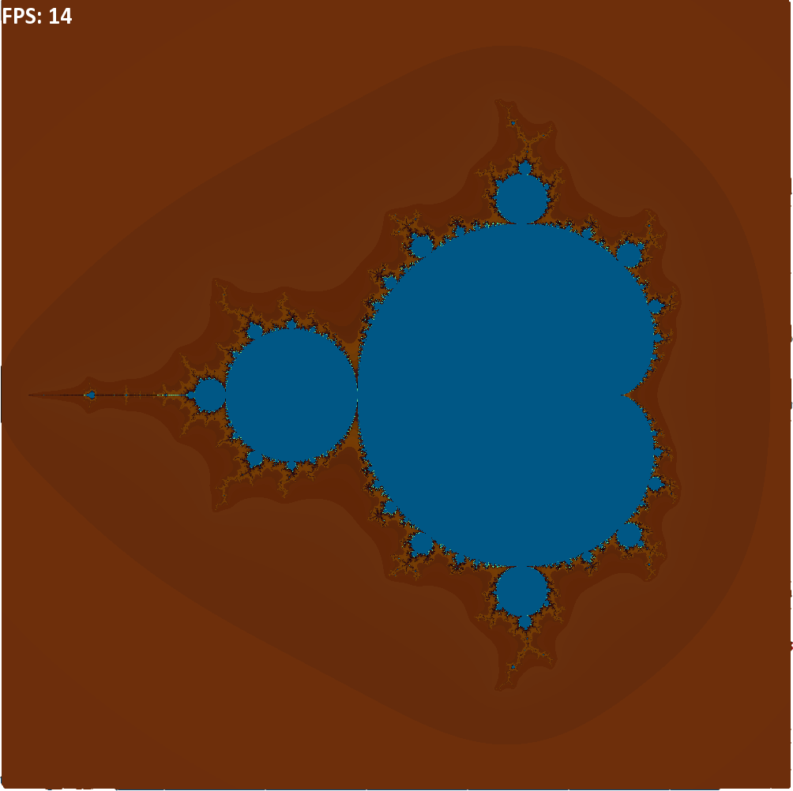

# Mandelbrot set

## Введение

Множество Мандельброта - множество точек плоскости, для задания которого каждой точке `A` с координатами `(x,y)` соответствует последовательность:

$$(x_0, y_0) = (x, y)               $$
$$ x_i = x_{i-1}^2 - y_{i-1}^2 + x_0$$
$$ y_i = 2x_{i-1} y_{i-1} + y_0     $$

Если последовательность ограничена, точка принадлежит множеству Мандельброта, иначе - нет.

Примерно так выглядит множество Мандельброта:



## Реализация

Для визуализации множества Мандельброта можно определить цвет пикселя, как функцию от `k`, где $|\vec{r}(x_k, y_k)| > R$, а $\forall i < k: |\vec{r}(x_i, y_i)|\leq R, (R - const)$.

Узким местом в программе является цикл, вычисляющий элементы последовательности выше, для нахождения `k`, по которому пересчитывается цвет пикселя. Реализовать вычисления можно разными способами:

* ### Попиксельная обработка
* ### Развертка цикла
* ### SIMD инструкции

Для определения производительности каждой реализации отдельная программа запускала узкое место `100` раз  при размере окна `800*800` и находила среднее время выполнения.

Среда тестирования:

| CPU                   | Compiler   | OS                     |
|-----------------------|------------|------------------------|
| AMD Ryzen 7 PRO 5850U | GCC 11.3.0 | Linux Mint 21 Cinnamon |

Флаги сборки:
```
-O3 -mavx2
```

Результаты тестирования:

| Версия    | Время, мс | Коэффициент ускорения относительно предыдущей версии |
|-----------|-----------|------------------------------------------------------|
| separated |  94.80    | 0.89                                                 |
| all in    | 106.84    | 0.64                                                 |
| simple    |  68.16    | начальная версия                                     |
| intrin    |  19.98    | 3.41                                                 |

Описание версий:

`simple` - попиксельная обработка

`all in` - развертка цикла, циклы векторизации в функции с узким местом

`separated` - развертка цикла, циклы векторизации в отдельных inline функциях

`intrin` - векторизация с использованием `avx2` инструкций

## Анализ результатов

Для рендеринга использовалась графическая библиотека `SFML`.
